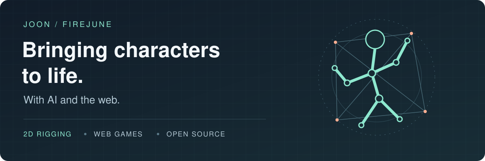

  

  <a href="https://firejune.io">Blog</a> ·
  <a href="https://store.steampowered.com/app/4718270/">Blosharper on Steam</a> ·
  <a href="https://x.com/firejune">X / @firejune</a>

I'm **Joon**, a frontend developer with **20+ years** of experience, now building games and the tools behind them. JavaScript is home; the browser is my playground.

My current focus is **AI-assisted 2D rigging and animation**: turning character artwork into parts, rigs, and motion that can run on the web. I build with AI agents, and I build tools that let them check their own work.

## From artwork to animation

Three open-source projects explore different stages of that journey:

| Project | What it does |
| :--- | :--- |
| **[spine-parts](https://github.com/firejune/spine-parts)** · Prepare | Turn character artwork and decomposed layers into rig-ready parts and AI-authored Spine rig specs. |
| **[rigc](https://github.com/firejune/rigc)** · Rig & animate | Compile declarative rig and motion specs into validated Spine skeleton data, ready for runtimes or the editor. |
| **[spine-html](https://github.com/firejune/spine-html)** · Play | Bring Spine animations to the browser with a DOM-first renderer, using CSS transforms for rigid parts. |

  
   
  A rigc demo: part images + rig and motion specs → an animated character.

**Also in the toolbox:** [unity2spine](https://github.com/firejune/unity2spine) converts Unity 2D rigged AssetBundles into Spine data, with a viewer and GIF exporter.

## A game out in the world

### 🌸 Blosharper: Battle of Blossoms

A roguelike deckbuilder built around **Hwatu**, Korean flower cards. Made with **TypeScript, DOM, and CSS**, packaged with Electron, and available on **Steam Early Access**.

It grew out of a question I've wanted to answer for years: **how far can web technologies go as a foundation for a game?** I designed, built, and shipped it alongside AI agents under **Joon x Jin Works**.

**[Play on Steam →](https://store.steampowered.com/app/4718270/)**

## More things I've built

- **[byteguard](https://github.com/firejune/byteguard)** — A Vite plugin for casual JavaScript source protection through binary encoding.
- **[headerless](https://github.com/firejune/headerless)** — Build-time removal of identifying asset headers; obfuscation, not encryption or DRM.
- **[electron-react-devtools](https://github.com/firejune/electron-react-devtools)** — React DevTools for Electron.
- **[jandi](https://github.com/firejune/jandi)** — Embed a GitHub contribution calendar into a document.

Earlier work: [struct.js](https://github.com/firejune/struct.js) · [clog](https://github.com/firejune/clog) · [swift](https://github.com/firejune/swift)
